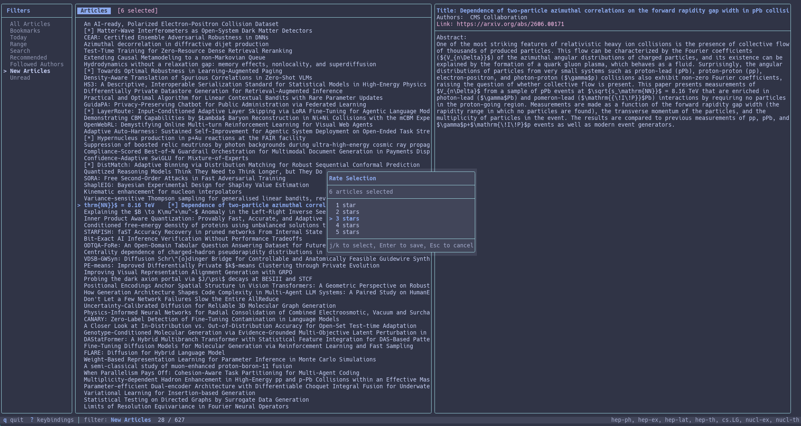

.. SPDX-FileCopyrightText: 2024-2026 Josh Isaacson
.. SPDX-License-Identifier: GPL-3.0-only

arxiv-tui
=========

A keyboard-driven terminal user interface for browsing, managing, and
downloading arXiv research papers — built in C++17 with
`FTXUI <https://github.com/ArthurSonzogni/FTXUI>`_.

**Highlights**

- Pulls articles from arXiv RSS feeds for any set of categories or author subscriptions
- Stores everything in a local SQLite database — works offline after first fetch
- Personalised ranking: rate articles 1–5 stars and let the built-in TF-IDF + MLP model
  surface today's most relevant papers in the *Recommended* filter
- Multi-article selection with bulk bookmark, delete, project-assign, and rating
- BibTeX export with automatic InspireHEP lookup
- Full-text search (SQLite FTS5), fuzzy search, and configurable filters
- Read/unread tracking, tag system, hierarchical projects, per-article notes
- Headless ``--fetch`` mode for cron-based refresh

.. toctree::
   :maxdepth: 2
   :caption: Contents

   installation
   configuration
   keybindings
   features
   ranking
   contributing
   changelog
